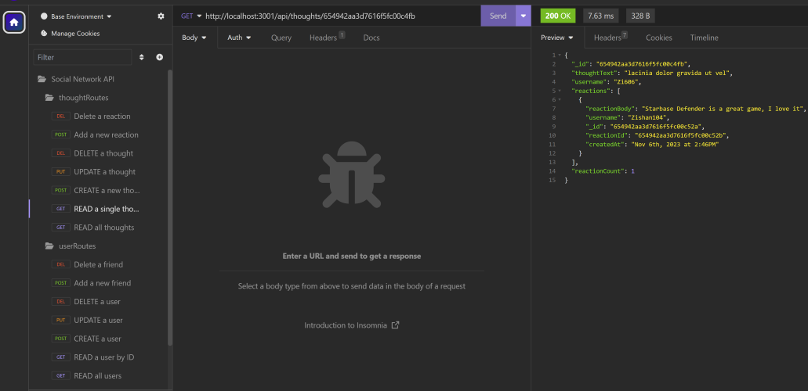

# Social Network API

## Description

 This project offers a simple and lightweight (but scalable) back-end for a possible Social Network app. By carefully defining the basic routes that such an API would possess, we give interested developers the flexibility of adding additional routes and implementing the front end that will serve them best. We divide the routes into two classes, each corresponding to a Mongoose ODM model. The models in question are the User and Thought model. There is also a reactionSchema that gives shape to the reactions subdocuments that are associated to the thoughts documents. The Social Network API offers the following functionality:

 1.Users can be created by adding a username and email. Those fields can be modified and they can be deleted from the database at any time.

 2.Users can create, modify, and delete thoughts.

 3.Users can react to thoughts by other users. They can also delete their reactions at any time.

 4.Users can add other users as friends. They are also able to unfriend them.

With the purpose of showing functionality, a module with functions and data arrays and another with some seeding commands were included in order to randomly generate sample data.

  Considered as an exercise in coding, this projects allows to opportunity to:
  
  1. Understand better the flexible (but not chaotic) nature of NoSQL databases, with their collections, documents, and nested subdocuments.

  2. Implement ODM (Object Document Mapping) using the Mongoose package and associated packages, in order to use model and schemas to shape documents and subdocuments and employ the Node JS dialect to make queries to the document store database. It is instructive to compare and contrast with the way queries are performed in a relational (SQL) database using ORM(Object Relational Mapping).

  We have continued refining the modularization/separation of concerns that have been one of the pillars of our incursion into back end development within the Node runtime environment. We have also tried to subscribe to the REST paradigm.

## Table of Contents

- [Installation](#installation)
- [Usage](#usage)
- [Credits](#credits)
- [License](#license)

## Installation

1. Go to the CLI of Git BASH and use the "mkdir" command to create a new directory for the folder. Use the "cd" command to change directory.

2. Navigate to <https://github.com/jguemarez/SocialNetworkAPI>, press the "<> Code" button, choose the most convenient way to clone the repo, and copy it to the clipboard.

3. Go back to Git BASH and append the copied string to the command "git clone" .

4. Enter whathever means of authorization (e.g. a passphrase for SSH Keys) they ask you.

5. Within Git BASH, run "npm install" to install the dependencies in the package.json file.

6. Run the command "npm run seed". That will create the new database for you and populate it with sample documents.

7. Enter "npm start" so as to synchronize the Mongoose models with the social_networkdb and have the Express server listening at the port stipulated in the "index.js" file found at the root level.

8.Once the message "API server for Social Media running on port 3001." appears in the terminal, you can start testing the routes. Since the project has no front-end, it will be required to use an API platform like "PostMan"/"Insomnia".

## Usage

Disclaimer: We test the routes using the Insomnia GUI. Since the sample data is randomly generated, the retrieved documents will in general differ each time the database is re-seeded.

1.When you test `/api/users` in order to get all available users:

2.When you test `/api/users/:userId` (substituting an actual _id for the route parameter) to get a single user document:

3.When you create a new user passing an appropriate JSON payload to the route-handler at `/api/users`:

4.When you update a user passing an appropriate JSON payload to the route-handler at `/api/users/:userId`:

5.When you delete a user at `/api/users/:userId`. Note that the thoughts associated to the user are also deleted:

6.It is possible to add a new friend for a user at `/api/users/:userId/friends/:friendId` by substituting the appropriate '_id' strings in the route parameters:

7.You can delete a friend from a given user's array by passing the appropriate '_id' strings through the route parameters in `/api/users/:userId/friends/:friendId`:

8.Retrieving all thought-related documents from the database by making a GET request to `/api/thoughts` :

9.Retrieving a single thought-related document by substituting the appropriate '_id' string for the route parameter in `/api/thoughts/:thoughtId`:

10.Generating a new document in the 'thoughts' collection by passing an adequate JSON payload at `/api/thoughts`. The newly created thought is added to the users' 'thoughts' array:

11.Updating a single thought by passing the required data in the req.body and the req.params using the `/api/thoughts/:thoughtId` endpoint :

12.Deleting a single thought by its '_id' string using the `/api/thoughts/:thoughtId` endpoint. Note that the document of the user who authored the thought gets updated :

13.By passing data in the body of the request (in accordance to the reactionSchema) and using the endpoint `/api/thoughts/:thoughtId/reactions`, you can add a new reaction to an existing thought:

14.By passing the appropriate '_id' and 'reactionId' strings through the route parameters in `/api/thoughts/:thoughtId/reactions/:reactionId`, it is possible to delete a reaction to a thought:

## Credits

This API is of the sole authorship of Jonathan Maldonado Guemarez.

The GitHub repo can be found at: <https://github.com/jguemarez/SocialNetworkAPI>.

The walkthrough video testing the routes in Insomnia can be found at: <https://watch.screencastify.com/v/MfdhKFLxclEN7DLzP0AG>.

The .gitignore file was lifted from the GitLab class repo found at: <https://git.bootcampcontent.com>.

The folder structure of the project and some of the helper functions found in the "utils" folder have been adapted from those in the activities and Mini-Project for the Module 18 of the Rutgers Full Stack Bootcamp.

This API works in the Node.js JavaScript runtime environment. The latest stable (recommended version) can be found at: <https://nodejs.org/en/download>

We use npm for the specification (semantic versioning) of the app's dependencies and their installation. Here is the URL for the official site of the npm registry: <https://www.npmjs.com>
Here are the dependencies for the development and production environments that we added, including links to find their most recent versions:

Dev-dependencies:

1. Nodemon: "^2.0.3". Used to continuously track the changes to the .js and .json file while coding and debugging, so as not to have to manually stop and restart the Express server from listening at the designated port after each change.
<https://www.npmjs.com/package/nodemon>

Dependencies:

1. Express: "^4.17.1". In order to create and work with servers, middleware, routers, etc.
<https://www.npmjs.com/package/express>

2. Mongoose: "^7.0.2". In order to use ODM with the MongoDB NoSQL database. Synchronizing the models and schema allowes us to structure our documents and subdocuments, to validate the values of certain fields, to transform/format the value of some of those fields, and to compute some additional properties that do not persist to the database. Everything is done using back-end JavaScript.

3. Mongoose-lean-virtuals:"^0.9.1". Allows attaching of virtuals to the results of mongoose queries when using .lean().
<https://www.npmjs.com/package/mongoose-lean-virtuals>

4. Mongoose-lean-getters: "^1.1.0". Makes the developer able to apply getters on lean() documents. In our case, we needed to use getters to format the date of certain documents and subdocuments.
<https://www.npmjs.com/package/mongoose-lean-getters>

## How to Contribute

If you want to contribute, feel free to fork the repo, modify the repo on your local machine and then open a pull request. That way I can review the changes before deciding whether to merge them in the codebase or not.

## Tests

The endpoints of this API have been extensively tested using Insomnia 2023.5.17 as a client.

However, the user should keep an eye for any error thrown either in Insomnia and in the Git Bash terminal and, if possible, open an issue in the GitHub repo detailing the bug. Exceeding the maximum call stack and reaching timeout before completion of a request were the major problems that were faced.

## Questions

The GitHub profile name of Jonathan Maldonado is "jguemarez" and you can checkout his profile at: <https://www.github.com/jguemarez>.
For further questions and comments, you can mail him to the following address: <cantor.dedekind112358@gmail.com>.

## License

This is an open-source project under the terms of agreement provided by the MIT license.
For more information, click on the following link: <https://opensource.org/license/mit>
